# Deep Snake on Satellite Imagery

In this work, we utilize the active contour Deep Snake [1] in the oil spill detection problem on satellite imagery collected from the European Space Agency (ESA) database [2].

The goal is to segment the oil spillage from multi-spectral images using Deep Snake. We use a dataset with preprocessed multi-spectral images to train Deep Snake to segment the oil spillage. 

The dataset encompass instances from 5 classes of interest: oil spills, look-alikes, ships, land, and sea surface, where the latter is the background class. From the main raw SAR data, a set of 1112 images were extracted, which are split into 1002 training and 101 test sets.

---

## Installation

We used a different enviornment more suited to our resources than the one suggested in the original repository for Deep Snake, and provided solutions to some of the frequent issues like gcc installation.

Please see [Install.md](Install.md).

---

## Results

We trained the original model using GeForce GTX 1080 Ti for 150 epochs on the oil-spillage dataset and it showed promising results. More experminets were conducted but the results are not ready for publishing yet.

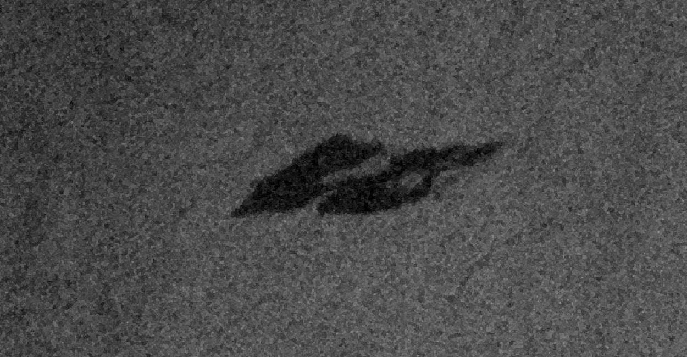  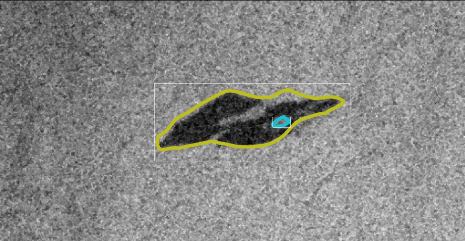

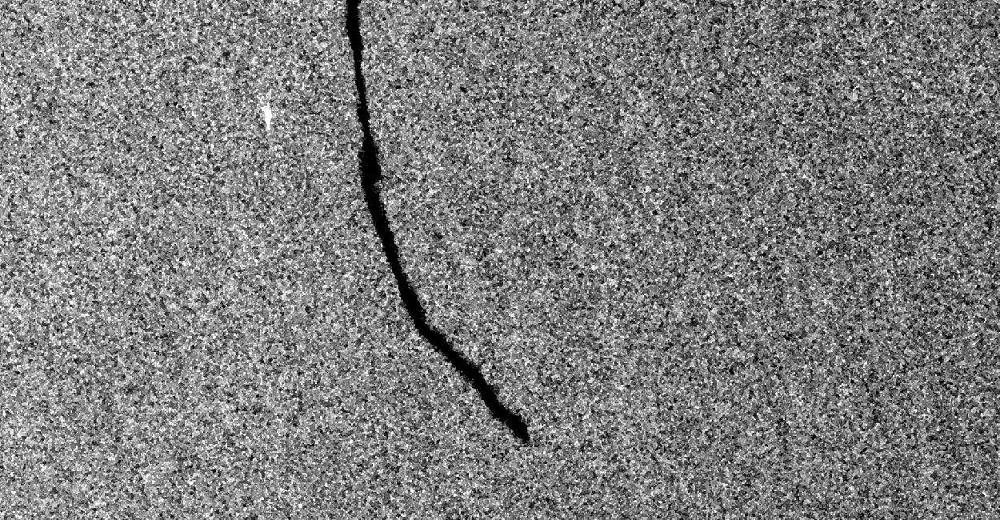  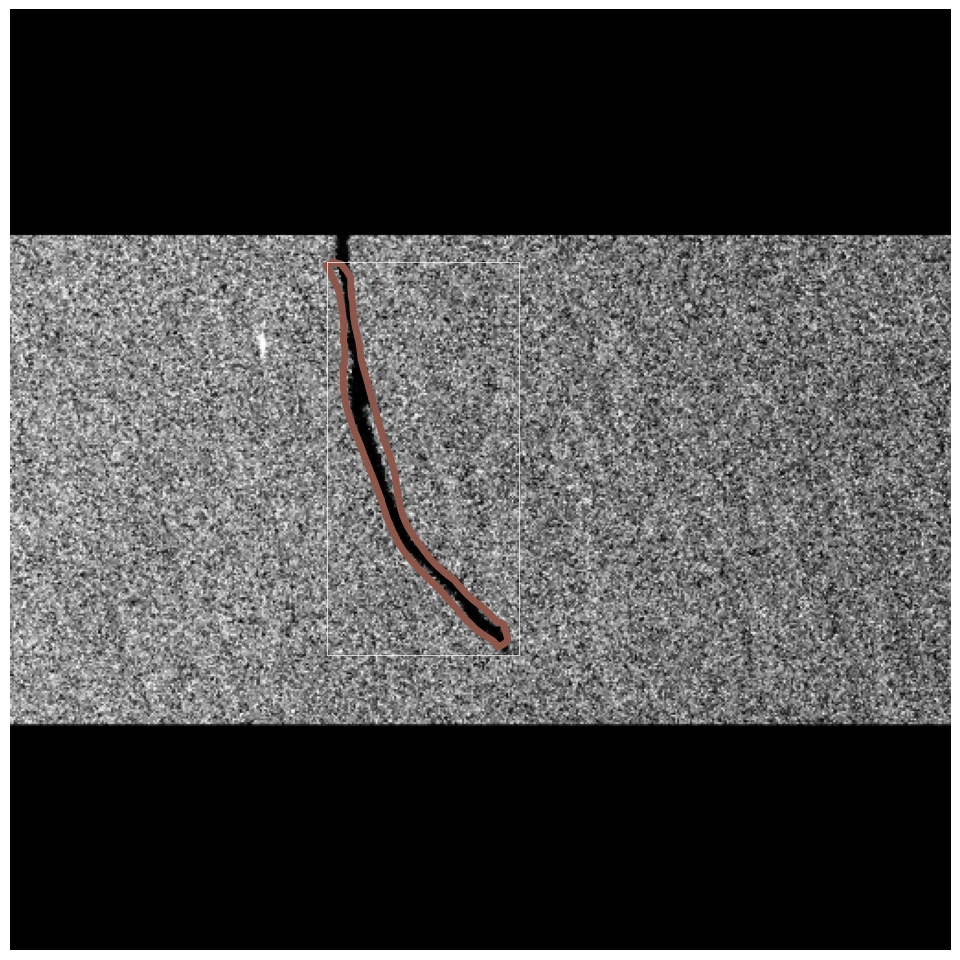

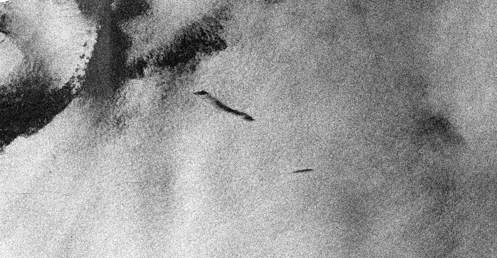 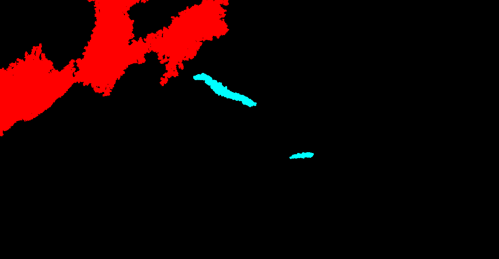 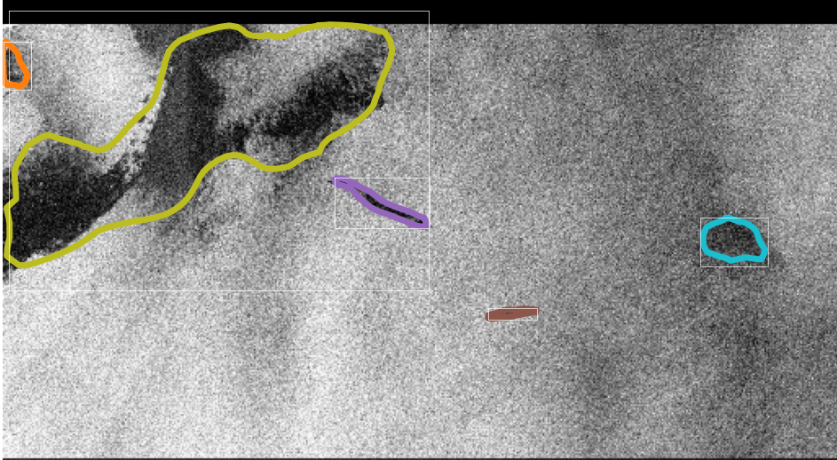

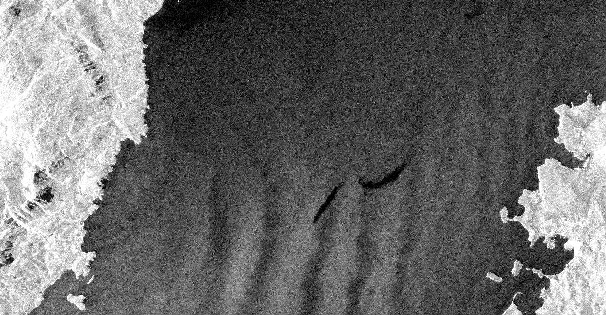 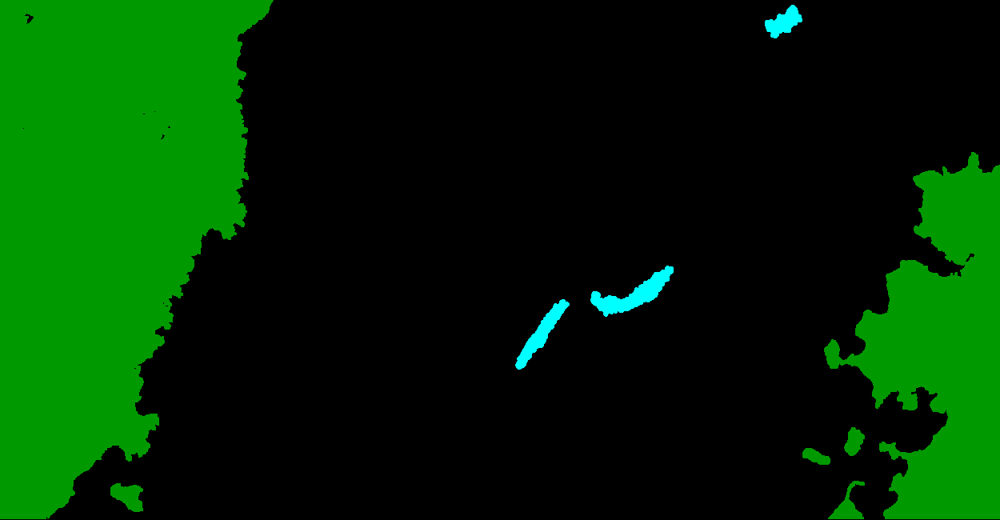 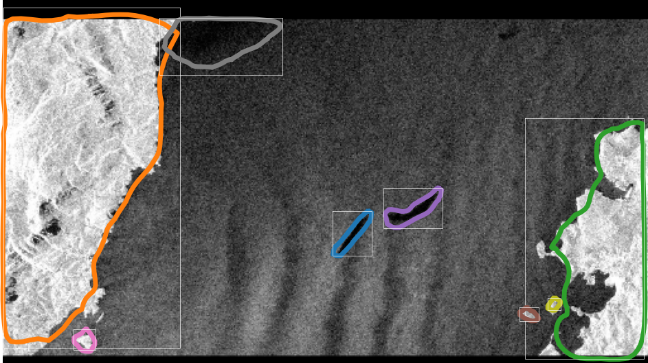

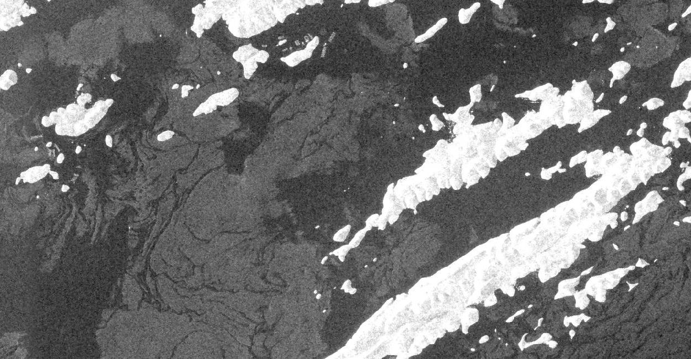 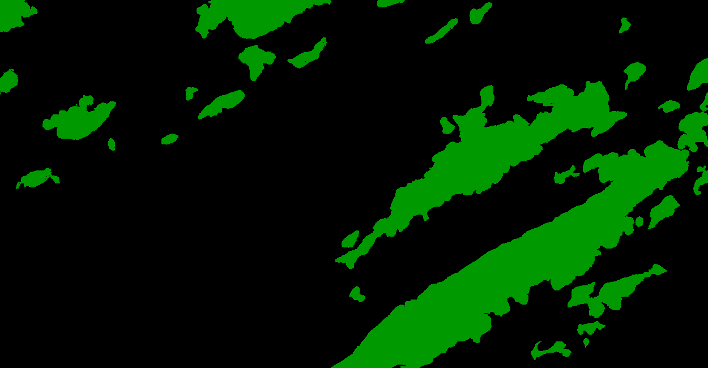 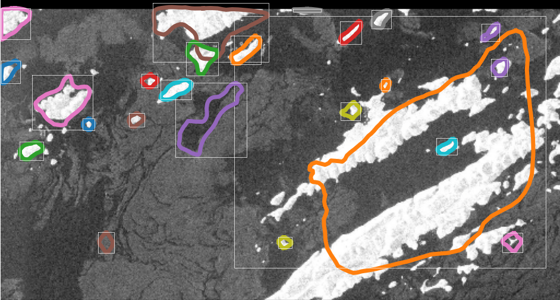

---

[1] [Deep Snake for Real-Time Instance Segmentation](https://openaccess.thecvf.com/content_CVPR_2020/papers/Peng_Deep_Snake_for_Real-Time_Instance_Segmentation_CVPR_2020_paper.pdf)

[2] [Oil spill detection dataset](https://m4d.iti.gr/oil-spill-detection-dataset/)
